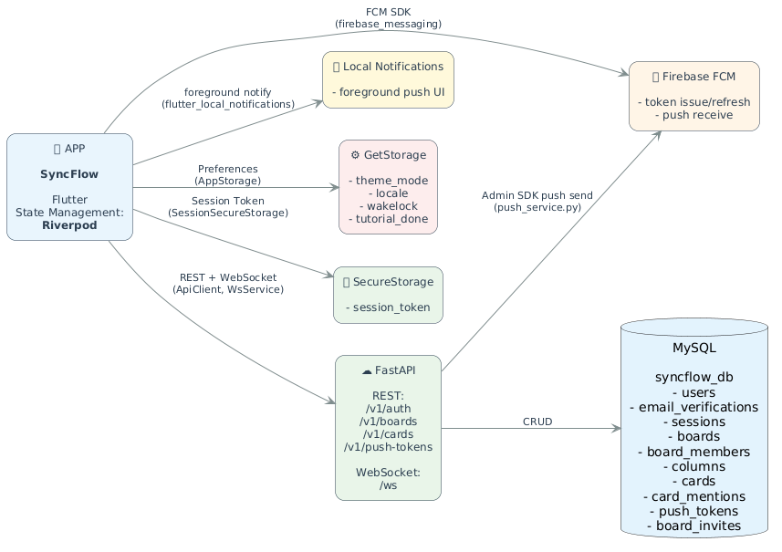

# SyncFlow

소규모 팀을 위한 실시간 경량 협업 칸반 보드 앱.

> **구현 계획**: [docs/PLAN_BASIC_STRUCTURE.md](docs/PLAN_BASIC_STRUCTURE.md)  
> **코딩 규칙**: [CURSOR.md](CURSOR.md)

---

## 제품 정의

| 항목 | 내용 |
|------|------|
| **한 줄 정의** | 소규모 팀을 위한 실시간 경량 협업 칸반 보드 앱 |
| **대상** | 2~5인 소규모 팀 (콘텐츠 제작, 스터디, 해커톤 등) |
| **핵심 가치** | 실시간 동기화, 템플릿 기반 빠른 시작, 미니멀 UX, 안정적 협업 |

---

## 주요 기능

| 기능 | 설명 |
|------|------|
| 계정·인증 | 이메일 6자리 코드 → UUID4 세션 토큰 (14일) |
| 보드 | 생성(템플릿 선택), 수정, 삭제(owner만) |
| 컬럼 | 추가, 이름 수정, 삭제, 순서 변경 |
| 카드 | 생성, 제목/설명 수정, 드래그 이동, 우선순위·담당자·마감일 |
| 실시간 동기화 | WebSocket 기반 카드 이동/수정 즉시 반영 |
| Soft Lock | 카드 편집 중 동시 편집 방지 (TTL 30초) |
| 푸시 알림(FCM) | 멘션/담당자 변경 이벤트 푸시, 포그라운드 로컬 알림, 푸시 탭 딥링크(보드/카드) |
| Presence | 보드 접속 사용자 아바타 표시 |
| 멤버 초대 | 6자리 초대 코드로 보드 참가 |
| 테마 | 라이트/다크/시스템, 영속화 |
| 다국어 | ko, en, ja, zh-CN, zh-TW |

---

## 기술 스택

| 구분 | 기술 | 용도 |
|------|------|------|
| 프론트엔드 | Flutter | iOS/Android/Web |
| 상태 관리 | Riverpod 3.0+ | Provider/Notifier 직접 구현 |
| 백엔드 | FastAPI | REST API, WebSocket |
| DB | MySQL | users, sessions, boards, columns, cards, card_mentions, push_tokens |
| 설정 | GetStorage | 테마·언어·wakelock 등 |
| 세션 | FlutterSecureStorage | 세션 토큰 암호화 저장 |
| 푸시 | Firebase Cloud Messaging | 디바이스 토큰 관리 + 이벤트 푸시 발송 |
| UI | Neo-Brutalism | 강한 대비, 두꺼운 보더, 오프셋 쉐도우 |

---

## 사용 패키지

| 패키지 | 버전 | 용도 |
|--------|------|------|
| **상태·UI** | | |
| flutter_riverpod | ^3.2.0 | 상태 관리 (보드, 카드, 세션) |
| **로컬 저장소** | | |
| get_storage | ^2.1.1 | 경량 설정 (테마, 튜토리얼, wakelock) |
| flutter_secure_storage | 9.0.0 | 세션 토큰 암호화 저장 |
| **네트워크** | | |
| http | ^1.1.0 | REST API (ApiClient) |
| web_socket_channel | ^3.0.1 | WebSocket 실시간 동기화 |
| firebase_core | ^4.5.0 | Firebase 초기화 |
| firebase_messaging | ^16.1.2 | FCM 토큰/메시지 수신 |
| flutter_local_notifications | ^19.4.2 | 포그라운드 로컬 알림 표시 |
| permission_handler | ^12.0.1 | 알림 권한 요청/상태 확인 |
| **다국어** | | |
| easy_localization | ^3.0.8 | 5개 언어 (ko, en, ja, zh-CN, zh-TW) |
| intl | ^0.20.2 | 날짜 포맷 |
| **기타** | | |
| showcaseview | ^5.0.1 | 튜토리얼/온보딩 스포트라이트 |
| in_app_review | ^2.0.11 | 스토어 평점 요청 팝업 |
| flutter_markdown_plus | ^1.0.3 | 카드 설명 마크다운 렌더링 |
| markdown | ^7.3.0 | 마크다운 파싱 |
| wakelock_plus | ^1.4.0 | 화면 꺼짐 방지 |
| package_info_plus | ^9.0.0 | 앱 버전 표시 (Drawer) |

**dev_dependencies**

| 패키지 | 용도 |
|--------|------|
| flutter_lints | 린트 규칙 |
| flutter_launcher_icons | 앱 아이콘 생성 |
| flutter_native_splash | 스플래시 화면 생성 |

---

## 아키텍처

**MVVM + Handler/Notifier**

```
lib/
├── main.dart
├── model/       # Board, Card, Column, User
├── view/        # auth, board_list, board_detail, main_scaffold, app_drawer
├── vm/          # Handler(API), Notifier(Riverpod)
├── service/     # api_client, ws_service, in_app_review_service
├── widget/      # card_tile, card_detail_modal, column_header, presence_avatars
├── theme/       # AppThemeColors, ConfigUI
├── util/        # common_util, config_ui, app_storage
├── navigation/
└── json/
```

```
fastapi/app/
├── main.py
├── api/         # auth, boards, cards, push_tokens
├── ws/          # connection, handlers, room, lock
├── utils/       # mention_util, push_service
├── database/
└── ...
```

- **View**: UI 렌더링만. `ref.watch`로 상태 구독, `ref.read`로 액션 호출
- **Handler**: API 접근 전담 (BoardHandler, CardHandler)
- **Notifier**: Riverpod 상태 관리 (boardDetailProvider, sessionNotifier 등)
- **테마**: `AppThemeColors` + `context.appTheme` + `ConfigUI` (Neo-Brutalism)
- **다국어**: `easy_localization` + `assets/translations/`. Drawer에서 언어 선택

### 시스템 구성도



> PNG 생성: `plantuml docs/system/system.puml`
> 현재 구현 반영 기준: FCM/PushToken/PushService 포함 (소스 갱신일 2026-03-05)

### 데이터 모델 (ERD)


> Mermaid 소스: [docs/erd/erDiagram.mmd](docs/erd/erDiagram.mmd)
> 현재 구현 반영 기준: `card_mentions`, `push_tokens` 포함 (소스 갱신일 2026-03-05)

---

## 버전 관리

앱 버전은 `pubspec.yaml`의 `version`에서 관리한다. (상세: [docs/DRAWER_AND_VERSION_GUIDE.md](docs/DRAWER_AND_VERSION_GUIDE.md))

```yaml
version: 1.0.0+1   # 1.0.0 = 버전명(사용자 노출), +1 = 빌드 번호(스토어 구분)
```

| 구분 | 설명 |
|------|------|
| 버전명 | 사용자에게 표시 (Drawer 푸터, 스토어). 예: 1.0.0 → 1.0.1 |
| 빌드 번호 | 스토어 업로드 시 이전보다 커야 함. 예: +1 → +2 |

**빌드 시 오버라이드**:
```bash
flutter build appbundle --release --build-name 1.0.1 --build-number 2
flutter build ios --release --build-name 1.0.1 --build-number 2
```

---

## 실행

### 1. Flutter 앱

```bash
flutter pub get
flutter run
```

**우선 기기**: iOS 시뮬레이터 (Debug 모드)

### 2. FastAPI 백엔드 (필수)

```bash
cd fastapi
python -m venv venv
source venv/bin/activate   # Windows: venv\Scripts\activate
pip install -r requirements.txt
# .env 설정 후
uvicorn app.main:app --reload --host 0.0.0.0 --port 8000
```

상세: [fastapi/API_GUIDE.md](fastapi/API_GUIDE.md)

### 3. API Base URL

앱은 기본적으로 `http://127.0.0.1:8000` (iOS) 또는 `http://10.0.2.2:8000` (Android 에뮬레이터)에 연결합니다.

원격 서버 사용 시 `lib/util/common_util.dart`의 `customApiBaseUrl`을 설정하세요.

```dart
const String? customApiBaseUrl = 'http://your-server.com:8000';
```

---

## WebSocket 연결 오류 (프록시/리버스 프록시)

`WebSocketException: Connection was not upgraded to websocket` 발생 시:

- **원인**: nginx, QNAP myqnapcloud 등 리버스 프록시가 WebSocket 업그레이드를 거부
- **해결**: 프록시에 WebSocket 업그레이드 설정 추가

**nginx 예시**:
```nginx
location /ws {
    proxy_http_version 1.1;
    proxy_set_header Upgrade $http_upgrade;
    proxy_set_header Connection "upgrade";
    proxy_set_header Host $host;
    proxy_pass http://127.0.0.1:8000;
}
```

- **임시**: WebSocket 실패 시 앱은 REST만으로 동작 (실시간 동기화 미지원)

---

## 문서

| 문서 | 설명 |
|------|------|
| [docs/PLAN_BASIC_STRUCTURE.md](docs/PLAN_BASIC_STRUCTURE.md) | 구현 계획 |
| [fastapi/API_GUIDE.md](fastapi/API_GUIDE.md) | FastAPI 엔드포인트, 설정 |
| [docs/RELEASE_BUILD.md](docs/RELEASE_BUILD.md) | 릴리즈 빌드 절차 |
| [docs/RELEASE_CHECKLIST.md](docs/RELEASE_CHECKLIST.md) | 앱 스토어 출시 체크리스트 |
| [docs/DRAWER_AND_VERSION_GUIDE.md](docs/DRAWER_AND_VERSION_GUIDE.md) | Drawer, 버전 표시 |
| [docs/TUTORIAL_SHOWCASEVIEW_GUIDE.md](docs/TUTORIAL_SHOWCASEVIEW_GUIDE.md) | 튜토리얼 화면 |
| [docs/NEW-FCM구현 및 설정가이드/README.md](docs/NEW-FCM구현 및 설정가이드/README.md) | Riverpod 기반 FCM 전체 가이드 |
| [docs/system/README.md](docs/system/README.md) | 시스템 구성도 설명 |
