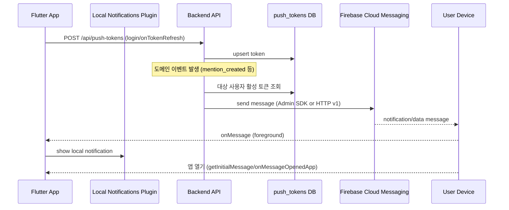
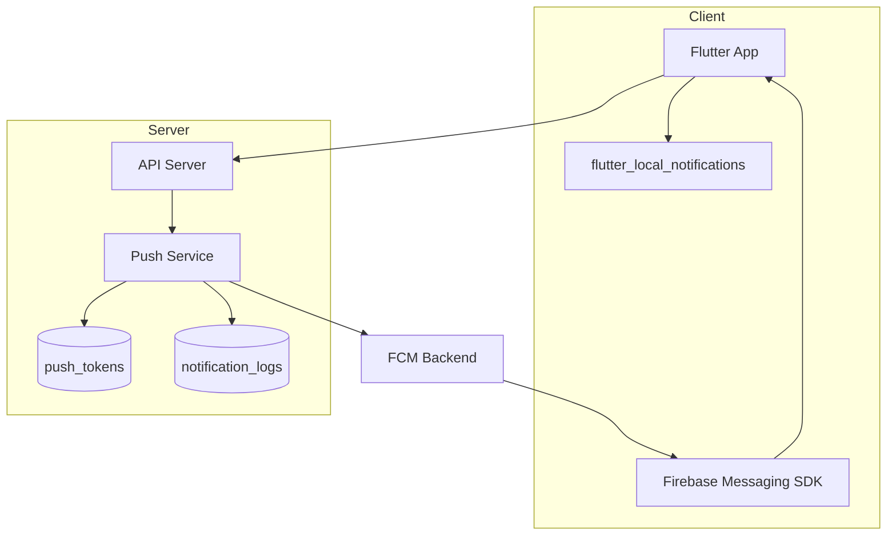

# FCM 푸시 시스템 다이어그램 (공용)

## 공용값 + SyncFlow 예시

- 공용 이벤트: `mention_created`, `card_assignee_changed`, `card_status_changed`, `board_invitation_updated`
- SyncFlow 도메인 식별자 예시:
  - `board_id` (보드)
  - `card_id` (카드)
  - `user_id` (사용자)
- SyncFlow API 경로 스타일 예시: `/v1/...`

## 1. 시퀀스 다이어그램



## 2. 컴포넌트 다이어그램



## 3. 이벤트 표준 예시

- `mention_created`
- `card_assignee_changed`
- `card_status_changed`
- `board_invitation_updated`

## 4. 딥링크 파라미터 표준

```json
{
  "type": "mention_created",
  "board_id": "<BOARD_ID>",
  "card_id": "<CARD_ID>",
  "target_user_id": "<USER_ID>"
}
```

## 5. 운영 지표

- 발송 성공률
- 평균 발송 지연
- 무효 토큰 비율
- 딥링크 이동 성공률

## 6. 검증 체크리스트

- [ ] 이벤트별 대상자 계산 정확성
- [ ] 동일 이벤트 중복 발송 방지
- [ ] 탭 시 목표 화면 이동
- [ ] 장애 시 재시도/DLQ 동작
