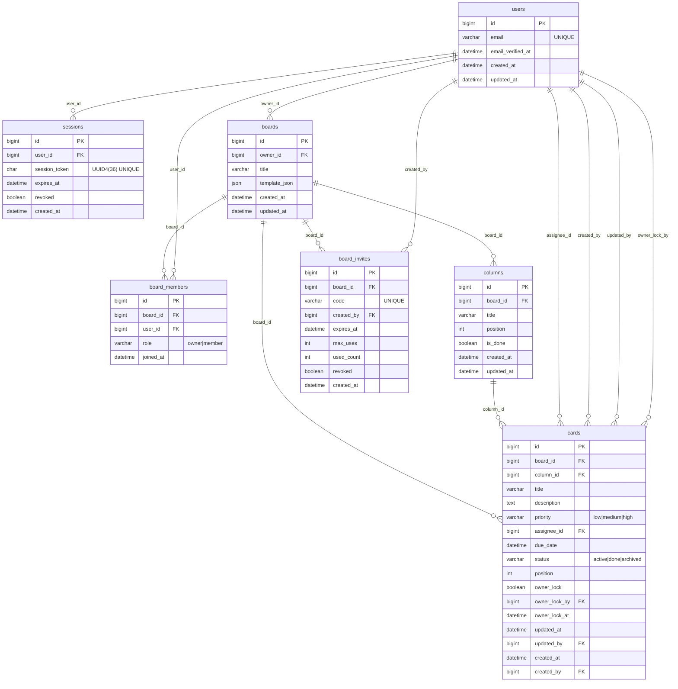

# 실시간 경량 협업 보드

## ERD v1.1 (초대 포함 통합본)

본 문서는 1차 MVP(개인 NAS + FastAPI + MySQL) 기준 데이터베이스 구조 정의 문서이다.

설계 원칙:

- 단일 인스턴스 운영 전제
- 협업 최소 기능 충족
- 실시간성 중심 구조
- 확장 가능성 고려 (과도한 구조 금지)

---

# 1. users

## 목적

계정 단위 사용자 관리

## 필드

- id (PK, bigint, auto increment)
- email (varchar, unique, not null)
- email\_verified\_at (datetime, null)
- created\_at (datetime, not null)
- updated\_at (datetime, not null)

## 인덱스

- UNIQUE(email)

---

# 2. sessions

## 목적

로그인 세션 관리 (UUID4 기반)

## 필드

- id (PK, bigint)
- user\_id (FK → users.id, not null)
- session\_token (char(36), unique, not null)
- expires\_at (datetime, not null)
- revoked (boolean, default false)
- created\_at (datetime, not null)

## 인덱스

- UNIQUE(session\_token)
- INDEX(user\_id)

---

# 3. boards

## 목적

협업 보드 단위

## 필드

- id (PK, bigint)
- owner\_id (FK → users.id, not null)
- title (varchar(255), not null)
- template\_json (json, null)  -- 템플릿 기반 확장 대비
- created\_at (datetime, not null)
- updated\_at (datetime, not null)

## 인덱스

- INDEX(owner\_id)

---

# 4. board\_members

## 목적

보드 참여자 관리

## 필드

- id (PK, bigint)
- board\_id (FK → boards.id, not null)
- user\_id (FK → users.id, not null)
- role (enum: 'owner','member', not null)
- joined\_at (datetime, not null)

## 제약

- UNIQUE(board\_id, user\_id)

## 인덱스

- INDEX(board\_id)
- INDEX(user\_id)

---

# 5. columns

## 목적

보드 내 컬럼 관리

## 필드

- id (PK, bigint)
- board\_id (FK → boards.id, not null)
- title (varchar(100), not null)
- position (int, not null)  -- 1000 단위 간격 권장
- is\_done (boolean, default false)  -- Done 컬럼 표현용
- created\_at (datetime, not null)
- updated\_at (datetime, not null)

## 인덱스

- INDEX(board\_id)
- INDEX(board\_id, position)

---

# 6. cards

## 목적

보드 내 작업 단위

## 필드

- id (PK, bigint)
- board\_id (FK → boards.id, not null)
- column\_id (FK → columns.id, not null)
- title (varchar(255), not null)
- description (text, null)  -- 경량 Markdown
- priority (enum: 'low','medium','high', default 'medium')
- assignee\_id (FK → users.id, null)
- due\_date (datetime, null)

\-- 상태/삭제 정책

- status (enum: 'active','done','archived', default 'active')

\-- 정렬

- position (int, not null)  -- 1000 단위 간격 권장

\-- Owner Lock

- owner\_lock (boolean, default false)
- owner\_lock\_by (FK → users.id, null)
- owner\_lock\_at (datetime, null)

\-- 수정 정보

- updated\_at (datetime, not null)
- updated\_by (FK → users.id, not null)
- created\_at (datetime, not null)
- created\_by (FK → users.id, not null)

## 인덱스

- INDEX(board\_id)
- INDEX(column\_id)
- INDEX(board\_id, status)
- INDEX(board\_id, position)
- INDEX(assignee\_id)

---

# 7. board\_invites (MVP 추가)

## 목적

초대 코드 기반 보드 참여 관리

## 설계 원칙

- 기존 ERD 구조에 최소 영향(테이블 1개 추가)
- board\_members 생성 전 검증 레이어 역할
- 물리 삭제 대신 만료/폐기 플래그 사용

## 필드

- id (PK, bigint)
- board\_id (FK → boards.id, not null)
- code (varchar(16), unique, not null)
- created\_by (FK → users.id, not null)
- expires\_at (datetime, not null)
- max\_uses (int, default 20)
- used\_count (int, default 0)
- revoked (boolean, default false)
- created\_at (datetime, not null)

## 제약

- UNIQUE(code)
- expires\_at 이후 사용 불가
- used\_count >= max\_uses 시 사용 불가
- revoked=true 시 사용 불가

## 인덱스

- UNIQUE(code)
- INDEX(board\_id)
- INDEX(expires\_at)

## 동작 흐름 요약

1. 초대 코드 생성 (board owner만)
2. 참여자가 코드 입력
3. 서버가 board\_invites 검증
4. 검증 성공 시 board\_members에 (board\_id, user\_id) 추가
5. used\_count 증가

※ board\_members UNIQUE(board\_id, user\_id) 제약으로 중복 참여 방지

---

# 8. 관계 요약

users (1) ── (N) sessions users (1) ── (N) boards (owner) users (N) ── (N) boards (board\_members)

boards (1) ── (N) columns boards (1) ── (N) cards boards (1) ── (N) board\_invites

columns (1) ── (N) cards

---

# 9. 1차 설계 의도

- Soft lock은 DB에 저장하지 않음 (서버 메모리 관리)
- 카드 물리 삭제 없음 (status=archived 사용)
- done은 컬럼(is\_done) + status(done) 병행 가능
- 확장 대비 template\_json 필드만 선반영
- 초대 기능은 board\_invites 테이블 추가로 확장
- 단일 인스턴스 전제

---

# 10. Mermaid ERD

---

다음 단계: MySQL DDL 생성 또는 API 명세 정의.

